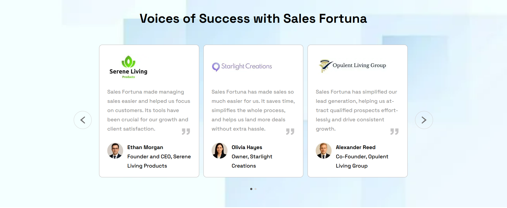

# Sales Fortuna

## 🧩 Project Overview

Sales Fortuna is a UI section that displays client testimonials in a responsive and interactive slider. It is designed
using modern frontend technologies like Swiper for carousel functionality and follows the Feature-Sliced Design (FSD)
architecture for scalable and maintainable code organization.


---

## Project Deployment

The project is deployed on the [Vercel](https://vercel.com) platform.  
To view the live production version of the app, please visit:

➡️ **[Go to the Vercel deployment](https://sales-fortuna.vercel.app/)**

---

## 🔧 Technologies Used

- React 19
- TypeScript
- Vite — fast development environment
- Swiper — for slider/carousel functionality
- FSD (Feature-Sliced Design) — modular project structure
- SASS — for styling
- ESLint — for code linting
- Cloudinary — image hosting

---

## 📁 Project Structure (FSD)

The project follows the FSD (Feature-Sliced Design) structure:

- `entities/` — core reusable entities
- `features/` — individual logic or business features
- `shared/` — common components, styles, helpers
- `widgets/` — composable UI blocks (e.g., testimonial slider)
- `pages/` — application pages

This modular design improves maintainability and scalability.

---

## 🚀 Getting Started

Clone the repository:

```bash
git clone https://github.com/your-username/sales-fortuna.git
cd sales-fortuna
```

Install dependencies:

```bash
npm install
```

Create a `.env` file in the root directory:

```
VITE_CLOUDINARY_CLOUD_NAME=your_cloud_name
```

Run the development server:

```bash
npm run dev
```

Open in browser: http://localhost:5173

---

## ✅ Features

- Displays customer testimonials with images, names, companies, and roles
- Swiper-based navigation (buttons & swipe support)
- Responsive and accessible design
- Structured and scalable with FSD principles
- Pixel perfect implementation matching design mockups

---

## ✅ Lighthouse Audit Results

To ensure high quality of the application, an audit was performed using Lighthouse. The audit covered the following
categories:

- Performance
- Accessibility
- Best Practices
- SEO

Below are screenshots of the audit results:
